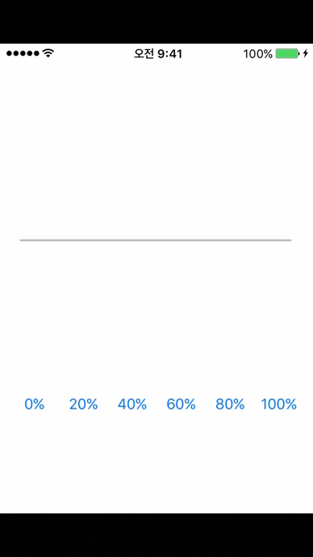

MJProgressView is a simple and Multiple colors in a UIProgressView.



## Installation

Installation is made simple with [CocoaPods](http://cocoapods.org/). If you want to do it the old fashioned way, just add `MJProgressView.h` and `MJProgressView.m` and `MJProgressViewController.h` and `MJProgressViewController.m` into your project.

## Requirements

## Installation

MJProgressView is available through [CocoaPods](http://cocoapods.org). To install
it, simply add the following line to your Podfile:

```ruby
pod "MJProgressView"
```

Then, simply place this line in any file that uses MJProgressView.

```objc
#import <MJProgressView.h>
```

MJProgressView works on iOS 6.0 and up.

## Usage

###Example usage: *.h

```objc
#import "MJProgressView.h"

@property (nonatomic, strong) MJProgressView *progress;

```

###Example usage: *.m

```objc
@synthesize progress;

NSArray *color = [[NSArray alloc]initWithObjects:[UIColor blueColor], [UIColor redColor], [UIColor orangeColor], nil];
progress = [[MJProgressView alloc] initWithFrame:CGRectMake(20, 200, 280, 2) progressCount:3 color:color];
[self.view addSubview:progress];

```

###On Progress Change
```objc
[progress setProgressAnimation:0.2];
```

## Author

minjoongkim, kmj6773@gmail.com

## License

MJProgressView is available under the MIT license. See the LICENSE file for more info.
